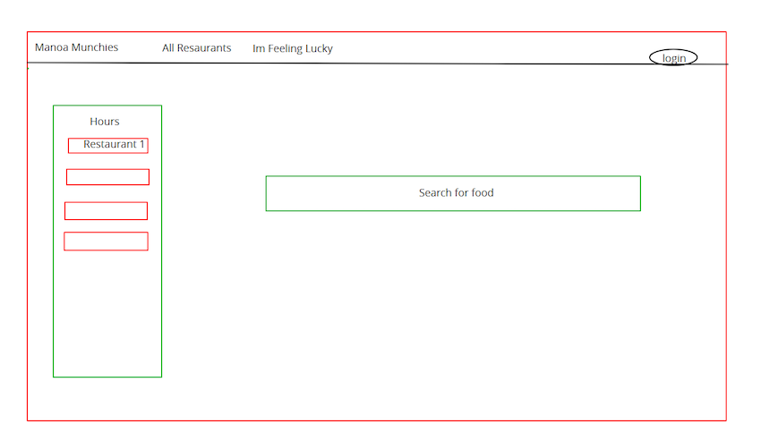
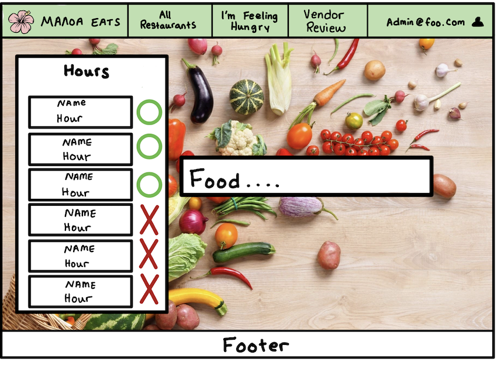
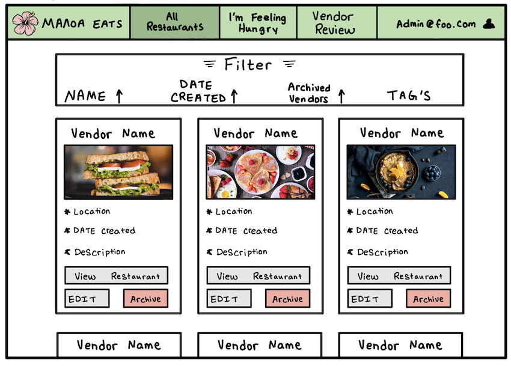
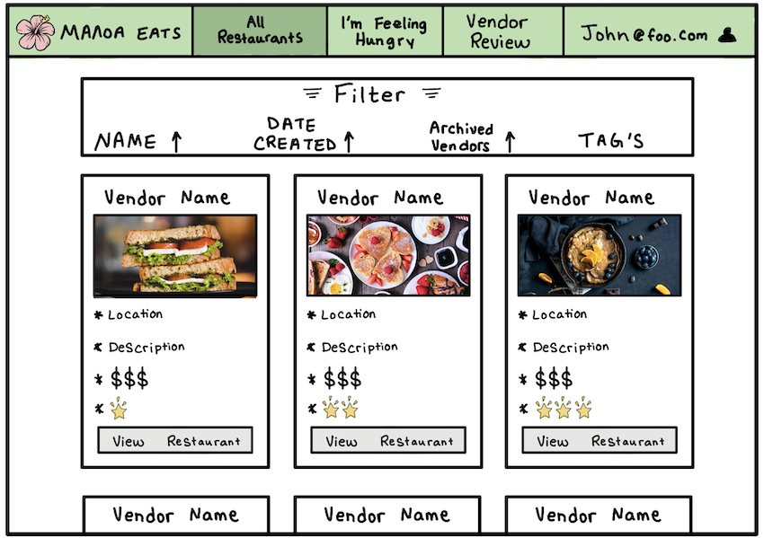
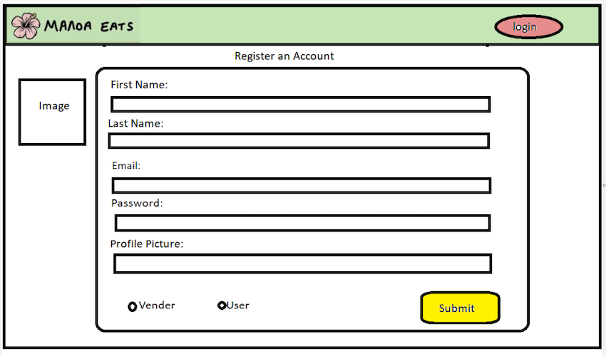
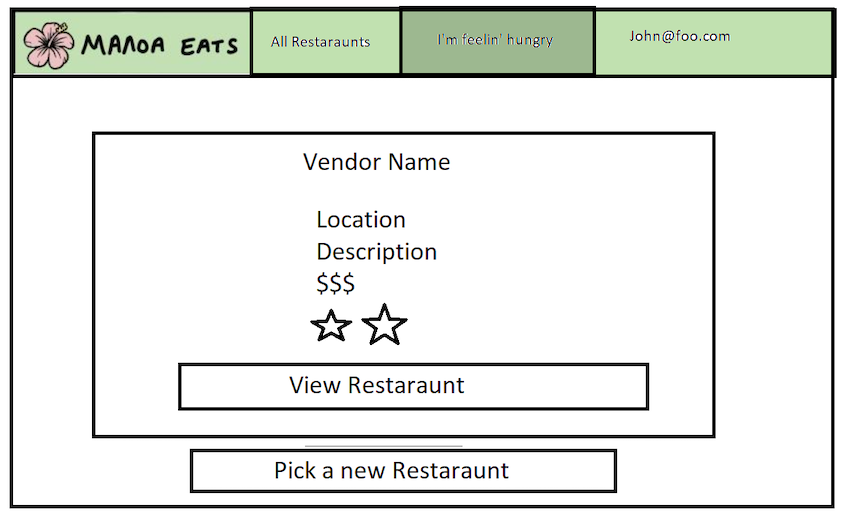
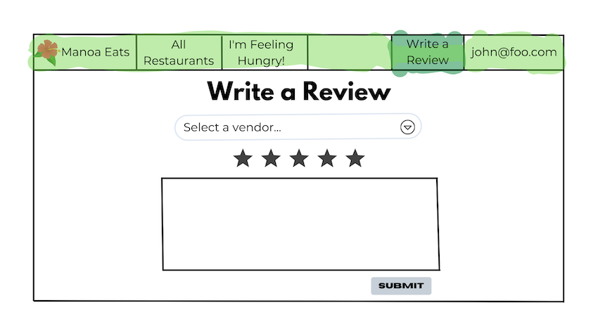
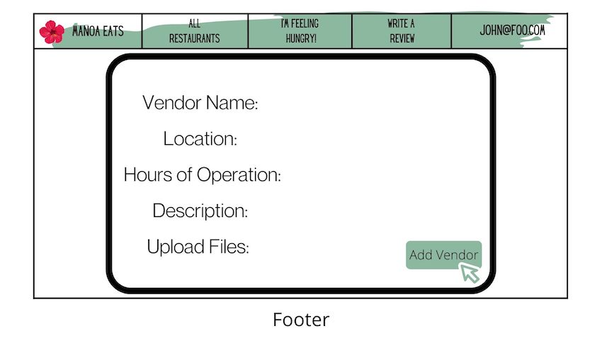

# Manoa Eats
## Table of contents

* [Team Contract](#team-contract)
* [Application Repo](#application-repo)
* [Overview](#overview)
* [Developer Guide](#developer-guide)
* [Development History](#development-history)
* [Deployment](#deployment)
* [User Guide](#user-guide)
* [Mockups](#mockups)
* [Team](#team)

# Team Contract
Manoa eats is a team consisting of 5 computer engineering and computer science students that have signed this [Team Contract](https://docs.google.com/document/d/1-v9pqiJ7Q1Jij45WQcrJkHYzmSRQN-saOC0DPg8Gzvk/edit?usp=sharing) to follow a work criteria we all decided upon.

# Application Repo
Visit [github.com/manoa-eats/manoa-eats](https://github.com/manoa-eats/manoa-eats) to access our application repo

# Overview
Manoa Eats is a web application that will allow students and staff access to the different eateries information on campus. When they visit our landing page they will notice a search bar in the middle of the page and a collum of the left of the page giving he hours of various eateries. At the top of the page there will be several different tabs which include an All Restaurants tab and I'm Feeling Hungry tab. Once the user signs in or creates an account they will able to have access to a reviews tab.

### The Problem
Not many students know about all of our fine dish eateries on the UH Manoa campus. In addition, some students who want to try new restaurants may not get a chance to because they may have time conflicts with their schedule leaving some restaurants having either too many students in line or not enough students.

### The Solution
Manoa Eats will allow hardworking students to nourish their brains with UH’s nutritious food located all around the campus. Students will be able to upload their schedules along with their course locations, and our website will estimate the best restaurant locations to stop at on their path to their next class.

# Developer Guide
### Installation

First, [install Meteor](https://www.meteor.com/developers/install)

Second, visit the [Manoa Eats application github page](https://github.com/manoa-eats/manoa-eats), and click "Use this template" button to create our own repository initialized with a copy of this application. Alternatively, you can download the sources as a zip file or make a fork of the repo. However you do it, download a copy of the repo to your local computer.

Third, cd into the Manoa Eats app/directory and install the libraries with:
```
$ meteor npm install
```
Fourth, run the system with:
```
$ meteor npm run start
```
If all goes well it will appear at [http://localhost:3000/](http://localhost:3000/)

# Development History

| Milestones | Description |
| --- | --- |
| [Milestone 1](https://github.com/manoa-eats/manoa-eats/projects/1) | **Mockup Development:** Our goals of Milestone 1 was to create different Mockups so we all were able to get a general idea of how we wanted different pages to look. We also needed to create a landing page of our website. The landing page is meant to help users get a general understanding of what our website is about.  |
| [Milestone 2](https://github.com/manoa-eats/manoa-eats/projects/4)| **Data Model Development:** Our mail goal of Milestone 2 was to improve the functionality and quality of or website beyond Milestone 1.  |

# Deployment

We added our current changes into our [Digital Ocean](http://178.128.242.94/#/) where everyone is able to see

# User Guide
### Landing Page
During Milestone one, our first page we worked on getting done was our landing page. When first coming up with the landing page we had our background picture only in the top portion of the page. The more we looked at it we all came to the conclusion that we wanted the background picture to take up the whole page. We also wanted to add a white background around the restaurants and their hours which is on the left side of our landing page. So will be creating those changes in our next Milestone.


This is our updated landing page where the image is taking up the full page. 


### Sign in Page
We also created the sign in page where users that have already created an account are able to log in and see reviews others have left on the different eateries.


You will also notice that once a user signs into their account there will be an addition tab in their nav bar. It will be the write a reviews tab.


# Mockups
### Mockup Landing Page
This landing page is the first mockup that was created during our first group meeting. It is a rough sketch of what we were thinking we wanted our landing page to look like. We wanted to keep it very simple and not too cluttered allowing people to visit our other tabs that we are envisioning our site will have.

<p align="center">

</p>

After that meeting we then wanted to make a better mockup to have a cleaner look and allow for our landing page to match the theme we are envisioning. The X's and O's on the left side of the page will indicate if a restaurant is opened or closed. In the middle of the page there is a search bar where you can look up a specific food and it will appear where it is being served at.

<p align="center">

</p>

### Admin Page
In addition to a standard user there is an admin user. They are able to edit the All Restaurants tab and archive or edit the different vendors, along with the other features that are available for a regular user.

<p align="center">

</p>

### All Restaurants Tab
With the All Restaurants tab users are able to see the restaurants and their description, reviews, price range, and location. Users are also able to filter their searches by either their name, date the restaurant was added to the website, and any specific tags.

<p align="center">

</p>

### User Page
Our user page is where people are able to register and create an account. It is a very simple form that asks for your name, email, password, and if you want to add in a profile picture. The user will also be able to indicate if they will be wanting a user profile or a vendor profile.

<p align="center">

</p>

### I'm Feelin' Lucky Tab
When a user access this tab they will be given a random restaurant with its details. If the user is not satisfied with their random choice they are always able to have another restaurant chosen at random.

<p align="center">

</p>

### Write a Review
Users are able to leave reviews on the different restaurants they visited so other users know what to except when going, if they have any menu recommendations, etc.

<p align="center">

</p>

### Adding a Vendor
After creating a vendor profile they will be able to add their restaurant to our life. They will need to add in their restaurant name, location, hours of operation, a short description about their restaurant, and they are able to upload any files (i.e. menus).

<p align="center">

</p>

## Team
Manoa Eats is designed, implemented, and maintained by
[Tyler Baguio](https://tylerb8.github.io), [Kristi Chinen](https://kristihchinen.github.io), [Jeraldine Milla](https://itsjerie.github.io), [Nenye Ndili](https://nenyehub.github.io), [Gavin Peng](https://devgav.github.io). 
